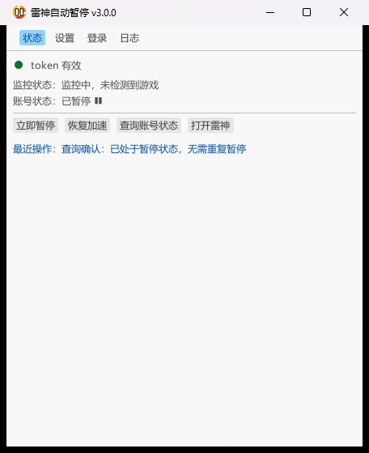
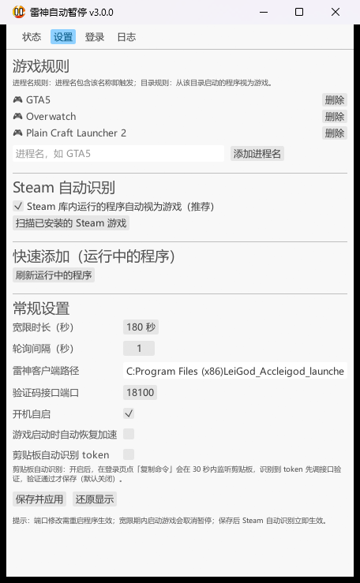
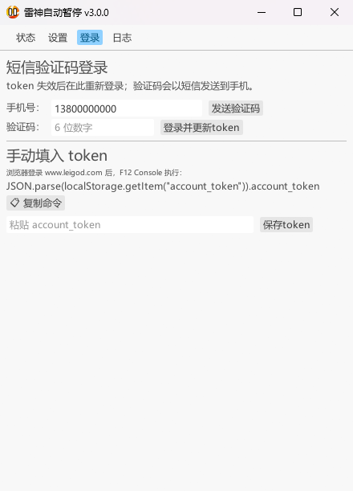
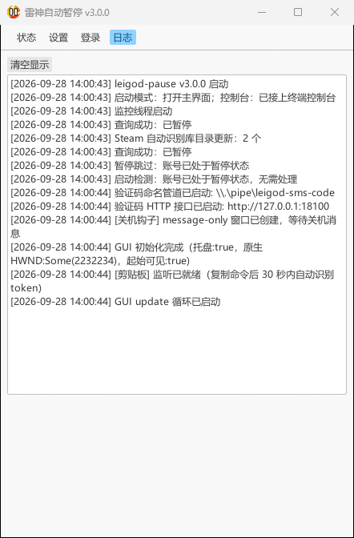

# leigod-pause — 雷神加速器时长自动暂停 (Rust 版 v3.0)

原 Python 项目 [6yy66yy/legod-auto-pause](https://github.com/6yy66yy/legod-auto-pause) 的 Rust 重写版。
API 现状调研与实测结论见 [API_NOTES.md](API_NOTES.md)，想改代码先看 [ARCHITECTURE.md](ARCHITECTURE.md)（写给 Rust 新手的架构说明）。

---

## ⚠️ 安全与隐私须知（配置为明文存储）

**`config.ini` 里的敏感信息全部是明文，没有任何加密或混淆**：

| 字段 | 内容 | 泄露后果 |
|---|---|---|
| `uname` | 手机号 | 隐私泄露，可能被用于撞库/骚扰 |
| `password` | MD5 密码（旧版兼容字段，当前登录链路不使用） | 弱密码可被爆破 |
| `account_token` | 账号登录态凭据 | **持有效期内可直接操作你的账号**（查询/暂停/恢复），等于账号被借用 |
| `smscode_key` | 最近一次短信验证码标识 | 配合短信码可在有效期内换到新 token |

因此：

- **不要把 `config.ini` 上传、分享、截图或提交到 Git**（本仓库 `.gitignore` 已排除 `config.ini`、`config-dev.ini`、`*.log`，但**克隆别人的仓库/自己 fork 时请再确认一次**）；
- 建议把程序放在**个人目录**，不要放在共享目录或会被自动同步到云端的目录（OneDrive / 坚果云 / 网盘同步目录）；
- 日志 `leigod_rs.log` 里手机号已打码（形如 `135****81`），但**仍包含操作记录**，分享日志前请自己过一眼；
- **剪贴板自动识别功能**开启后，token 会短暂停留在系统剪贴板里；Windows 的剪贴板历史（`Win+V`）和「跨设备云剪贴板」可能把它记录下来，敏感环境下请在设置里关闭该功能，或事后用 `Win+V` 清掉；
- 该文件等同账号钥匙：**转移/卸载/送修前记得删除**；怀疑泄露就去官网重新登录一次，旧 token 会随之失效。

---

## 界面预览

| 状态 | 设置 |
|---|---|
|  |  |
| 一眼看到 token 是否有效、账号是否已暂停、监控状态与宽限倒计时 | 游戏规则增删、Steam 自动识别、扫描运行中的程序、常规设置 |

| 登录 | 日志 |
|---|---|
|  |  |
| 进入页面即自动复制取 token 命令，也支持短信验证码与手动粘贴 | 实时日志，排查问题先看这里（同时写入 exe 同目录 `leigod_rs.log`） |

> 截图为开发机上的浅色主题（示例配置：手机号为占位号码、游戏列表为示例）；界面同样支持深色主题，配色会随系统主题自适应。

---

## 功能

- **启动即静默**：编译为 GUI 子系统程序，双击 / 开机自启都不弹控制台、不弹界面，直接进托盘
  - `leigod-pause.exe`：后台静默运行（默认，开机自启入口就写这个参数 `--hidden`）
  - `leigod-pause.exe --show`：启动时打开主界面；若程序已在运行则把主界面叫到前台
  - `leigod-pause.exe --console`：额外开一个控制台窗口实时看日志（调试用）
- **托盘常驻**：右键菜单（打开主界面 / 暂停时长 / 恢复时长 / 打开雷神 / 退出并暂停 / 退出），tooltip 实时显示监控状态，状态变化弹 Windows 通知
- **主界面**（egui 四页签）：
  - 状态：token 灯 / 账号暂停状态 / 监控状态与宽限倒计时 / 手动暂停·恢复·查询按钮
  - 设置：游戏进程名列表、宽限时长(10-600s)、轮询间隔、雷神路径、开机自启、自动恢复加速开关
  - 登录：发送短信验证码 → 输码 → 一键更新 token；也支持直接粘贴浏览器提取的 token
  - 日志：实时滚动
- **登录页取 token**：命令会**在进入登录页时自动复制到剪贴板**（也可用「📋 复制命令」按钮再复制一次）；
  开启设置里的「剪贴板自动识别 token」后，进入登录页同时开启 30 秒监听
  （系统剪贴板变更通知，不轮询、不占用剪贴板），识别到 token 先调接口验证、
  验证通过才写入配置，同时保留手动粘贴输入框
- **游戏监控**：轮询进程列表，游戏全部退出后进入 **180 秒宽限**（可调），期间游戏再次启动立即取消暂停，倒计时结束自动调用暂停接口
- **Steam 自动识别**（设置页独立开关，`auto_steam`，默认开），两层机制：
  - **库内程序自动视为游戏**：自动检测所有 Steam 库目录（注册表 + `libraryfolders.vdf`），运行中的程序 exe 位于任意库的 `steamapps/common` 之下即视为游戏在运行，**无需逐个添加规则**；库目录启动时加载、之后每 10 分钟刷新（覆盖中途新加装的 Steam 库），关闭开关立即失效
  - **扫描已安装的 Steam 游戏**：设置页「扫描已安装的 Steam 游戏」按钮，读取各库 `appmanifest_*.acf` 列出所有已装游戏，勾选后一键以**目录规则**（进程 exe 路径位于该游戏安装目录下即命中）加入游戏列表；自动跳过 Steamworks 运行库与 Spacewar 测试应用
  - 判定优先级：显式进程名规则 → 显式目录规则 → Steam 库自动识别；自动识别只对 Steam 正版库生效，**非 Steam 版游戏**请用进程名或目录规则
- **关机强制暂停**：钩住 WM_QUERYENDSESSION/WM_ENDSESSION，关机前同步调暂停接口（2s 超时 × 2 次重试）
- **token 自动续期接口**（短信验证码双通道，供短信转发 App / 脚本全自动续 token）：
  - HTTP：`POST http://127.0.0.1:18100/token/sms`（触发发码）→ `POST /token/code`，body `{"code":"867020"}`（换新 token）
  - 命名管道：`\\.\pipe\leigod-sms-code`，每行一条，`sms`=触发发码，纯数字=提交验证码
  - `GET /status` 实时状态、`GET /health` 存活探测
- **CLI**：`leigod-pause.exe info|pause|resume|sms|code <验证码>|status|help`
  （在终端里运行会自动接上父控制台，输出照常显示；`| more`、`> out.txt` 重定向也可用）
- token 失效时暂停请求**挂起**，任意通道更新 token 后自动补暂停

## 配置

exe 同目录 `config.ini`，**完全兼容旧版字段**（可直接拷贝旧文件的 games/uname/password 等）：

```ini
[config]
path = "C:\Program Files (x86)\LeiGod_Acc\leigod.exe"  ; 雷神客户端路径
uname = 13800000000          ; 手机号
games = GTA5,Overwatch,notepad
update = 1                   ; 轮询间隔(秒)
grace = 180                  ; 游戏退出后宽限秒数(新增)
http_port = 18100            ; 验证码接口端口(新增)
autostart = 1                ; 开机自启(新增)
auto_recover = 0             ; 检测到游戏启动自动恢复加速(新增,默认关)
auto_steam = 1               ; Steam 库内程序视为游戏(默认开)
clip_watch = 0               ; 剪贴板自动识别 token(默认关)
account_token = ...          ; 登录后自动写入
```

> 登录说明：雷神 2024 年后给密码登录加了 CloudWAF 拦截 + 极验验证，纯密码 API 登录已不可行；
> 本工具用 **token 鉴权 + 短信验证码重登** 方案（实测可用，详见 API_NOTES.md）。

## 开发

环境要求：**Windows 10/11**（程序大量使用 Windows API，不支持其它平台）+ Rust 工具链（stable，本项目在 1.95 上开发；MSVC 或 GNU 工具链均可，构建脚本用 `winresource` 往 exe 里嵌图标，需要系统有 `windres`/`rc` 等资源编译器）。

```bash
cargo build          # 调试构建
cargo test           # 单元测试（签名算法、Steam vdf 解析、剪贴板 token 提取）
cargo build --release # 发布单 exe（内嵌图标）
```

架构、模块职责、线程模型、常见修改指引见 [ARCHITECTURE.md](ARCHITECTURE.md)。

测试/验证脚本（都在 `scripts/`）：

| 脚本 | 用途 |
|---|---|
| `test_shutdown_msg.ps1` | 向运行中的程序发 `WM_QUERYENDSESSION`，模拟关机，验证关机强制暂停 |
| `check_windows.ps1` | 按 PID 列出程序的所有顶层窗口与可见性，确认"静默启动"确实没有可见窗口 |
| `hide_main_window.ps1` | 按 PID 向主窗口发 `WM_CLOSE`（等价于点 X，应隐藏到托盘） |
| `screenshot_window.ps1` | 用 `PrintWindow` 只截程序窗口（不抓桌面内容），验证界面配色/字体 |
| `click_client.ps1` | 向窗口客户区发送一次点击（GUI 验证用，注意 egui 对注入点击的响应有限） |

日志文件 `leigod_rs.log`（UTF-8，建议用 VSCode 等查看，GBK 终端 `type` 会乱码）。

---

## 参考项目

本项目在开发过程中参考了以下项目（均为独立的第三方项目，与本项目无隶属关系）：

| 项目 | 语言 | 参考了什么 |
|---|---|---|
| [6yy66yy/legod-auto-pause](https://github.com/6yy66yy/legod-auto-pause) | Python | **本项目的起点**：`config.ini` 字段与格式、托盘交互流程、游戏进程名匹配方式 |
| [hobk/leishen-auto](https://github.com/hobk/leishen-auto) | Go | 验证了"用 `account_token` 直连接口"这条路线可行（本项目同样是 token 方案） |
| [leigod.com](https://www.leigod.com) | — | 接口行为与错误码的实测对象（官网前端所用的 HTTP 接口，非公开 API） |

> **注（功能归属）**：「关机强制暂停」（钩住 `WM_QUERYENDSESSION` / `WM_ENDSESSION`，关机前抢着把时长暂停）**不是上游 Python 项目的功能**，而是**维护者自己在 Python 版上改造加的**（上游 `TrayIcon.py` 未处理任何关机消息，已核实）；Rust 版沿用并加强了它（2 秒超时 × 2 次重试、失败也允许关机继续）。

## 编写者说明

本项目的 **Rust 版本（代码 + 文档 + 验证脚本）由 AI 编程工具协作完成**，仓库维护者负责提需求、定方案、真机验收。

| 工具 / 模型 | 承担的工作 |
|---|---|
| **ZCode** | 编程 Agent（本次重写所用的开发环境）：读代码、写代码、编译排错、真机验证、Git 提交都由它执行 |
| **GML 5.3 Flash** | 参与编写的模型 —— **本项目工作量最大的部分由它承担** |
| **DeepSeek V4.1 Flash** | 参与编写的模型 |

> 生成结果已尽可能在真机上验证过（雷神接口实测、托盘/界面/开机自启/关机钩子/剪贴板功能验证 + 单元测试 8 项），
> 但不保证没有疏漏，使用前请按下面的「免责声明」自行评估风险；发现问题欢迎提 Issue。

---

## 免责声明

1. **非官方项目**：本工具是个人自用的第三方实现，与雷神加速器（Leigod）及其关联公司**没有任何关系**，未获得其授权、赞助或认可，也不是其官方产品。
2. **接口来自观察与实测**：程序通过官方网页前端所使用的 HTTP 接口实现功能（相关记录见 [API_NOTES.md](API_NOTES.md)）。这些接口**并非公开 API，可能随时变更、限流或失效**，作者不承诺可用性，也不负责随之而来的功能中断。
3. **使用风险自负**：因使用本工具（包括但不限于自动暂停/恢复计时、自动读取剪贴板、写入开机自启）可能导致的**账号异常、被风控/封禁、时长或权益异常、数据丢失**等任何直接或间接后果，**由使用者自行承担**，作者不承担任何责任。
4. **请遵守规则与法律**：使用前请自行确认是否符合雷神加速器的用户协议及你所在地区的法律法规。**请勿用于商业用途、批量账号操作或任何绕过官方限制的场景。**
5. **配置明文存储的固有风险**：如上一节所述，`config.ini` 明文保存手机号与 `account_token`，请自行保护好该文件；因文件泄露造成的损失与作者无关。
6. **无担保**：本软件按"现状"（AS IS）提供，不附带任何明示或暗示的担保，包括但不限于适销性、特定用途适用性与不侵权担保。
7. **致谢与更正**：思路与配置格式源自 [6yy66yy/legod-auto-pause](https://github.com/6yy66yy/legod-auto-pause)。若相关权利方认为本项目存在不妥，请联系作者，我们会及时处理（停止分发或删除相关内容）。

下载、编译或运行本程序，即表示你已阅读、理解并同意以上条款。

---

## 开源协议

本项目以 [MIT License](LICENSE) 发布。

- 选 MIT 的考虑：工具类小项目，希望任何人都能自由使用、修改与二次分发，只需保留版权与许可声明；
- 上游 [6yy66yy/legod-auto-pause](https://github.com/6yy66yy/legod-auto-pause) **未声明任何开源协议**（默认保留所有权利），本项目为其独立 Rust 重新实现，本协议仅覆盖本仓库的代码与文档；
- 上文「免责声明」（尤其针对雷神官方接口使用风险的条款）与 MIT 协议同时适用，不因协议而减弱。
